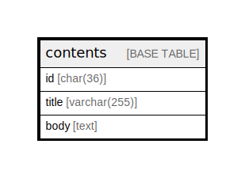

# contents

## Description

コンテントテーブル

<details>
<summary><strong>Table Definition</strong></summary>

```sql
CREATE TABLE `contents` (
  `id` char(36) NOT NULL COMMENT 'コンテンツID',
  `title` varchar(255) NOT NULL,
  `body` text NOT NULL
) ENGINE=InnoDB DEFAULT CHARSET=utf8mb3 COMMENT='コンテントテーブル'
```

</details>

## Columns

| Name | Type | Default | Nullable | Children | Parents | Comment |
| ---- | ---- | ------- | -------- | -------- | ------- | ------- |
| id | char(36) |  | false |  |  | コンテンツID |
| title | varchar(255) |  | false |  |  |  |
| body | text |  | false |  |  |  |

## Relations



---

> Generated by [tbls](https://github.com/k1LoW/tbls)
